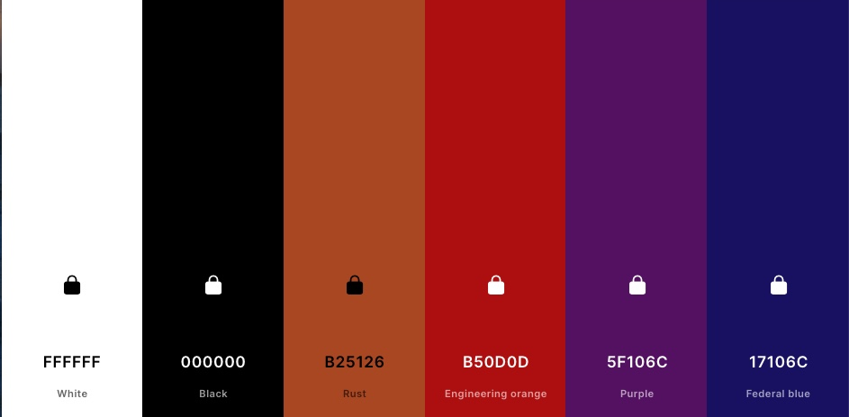
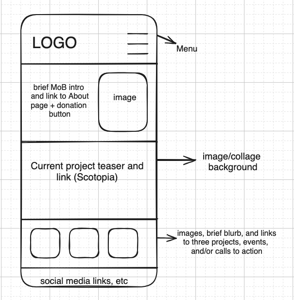
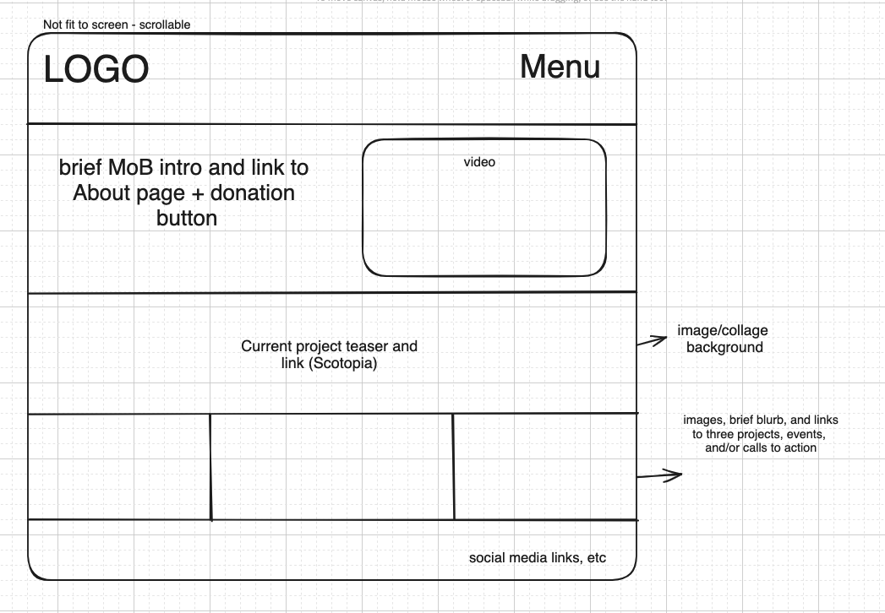
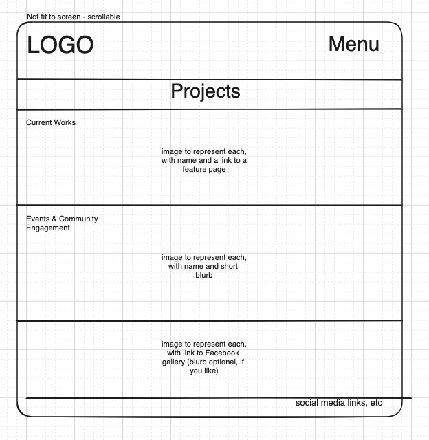
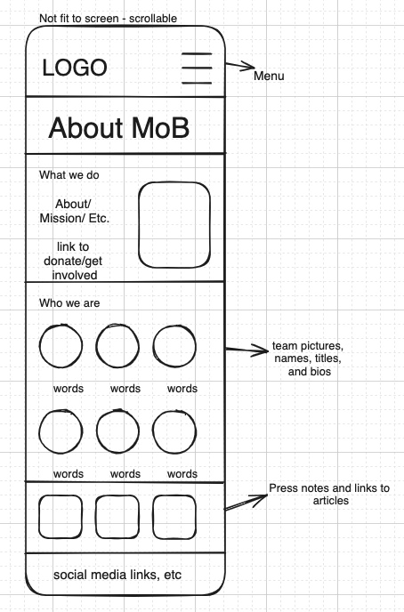
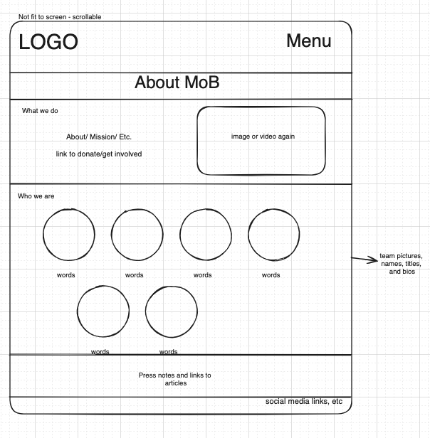
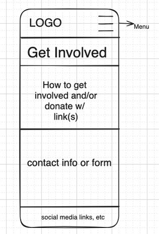
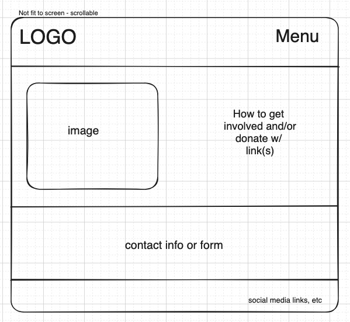

# Mouths of Babes Website

To be deployed on Netlify. ETA: Late August.

"Under construction" page up on custom domain Aug. 24 (when domain expires on Wix).

## Client Description:

Mouths of Babes Theatre Company was founded in 2014 on the principles of active agency and respect for young adult audiences and actors. They’re dedicated to creating engaging, interesting, and smart theatre for actors and audiences for the purposes of building community. They especially want to promote and support young actors and audiences to be active participants, not only in the arts, but in the world around them. They seek new forms to tackle today's changing issues. They see theatre through a contemporary lens and use forms of devising theatre and documentary theatre to contribute truth and reconciliation by using art to establish connections.

## Pages:

- **Home/Landing** (includes a section teasing a current project **or Scotopia** and a link to the appropriate page, link to a donation option also prominently featured)
- **Projects** (includes current and previous works, events, and community engagement)
- **Individual project pages** (not in main menu, linked from Projects page): (1) Scotopia, **others?**
- **About** (includes Our Team and Press sections)
- **Get Involved/Contact Us** (with link to a donation option)

**Notes:** Trey is still getting clarity from the ticketing platform (On the Stage) about selling tickets and merch directly on MoB site. Need clarity on donation option, as well.

## Design & Branding Notes:

- Informal, punk/grunge but not destructive or negative, playful, whimsical, edgy, smart
- Sketches, soft scribbles, spraypaint (not excessive), collages
- Current fonts: Avenir (not on Google Fonts; subbing Montserrat) and Overlock (on Google Fonts)
- **Notes:** Gracie is looking for the best photos to showcase. Trey asked Chloe about making a couple of collages for the site.

## Colors:

- Red, burnt orange, black, white, dark purple, dark blue
- Hex Codes: #B50D0D, #000000, #b25126, #5F106C, #17106C

**Color Palette**

## Other Requests:

- **Easy for staff/interns to update content (2-3 x a year):** I want to prioritize getting an attractive, guest-friendly site live by September, so the initial deployment may not include an intuitive, non-developer option for updating. However, I will update content (upon MoB request) during this time and incorporate an admin user option within the first year.

## Wireframes for Primary Pages:

**Note:** I'd love to use a collage for the menu/logo background. It would lend some consistency to the site. Also, I think including contact info in the footer, like you've been doing, is a good idea.

### Home Page

**Mobile**

**Desktop**

### Projects

**Mobile**

**Desktop**

### About

**Mobile**

**Desktop**

### Contact Us/Get Involved

**Mobile**

**Desktop**

## Dependencies:

- TBD

## Assets from:

- Google Fonts
- Canva
- TBD
